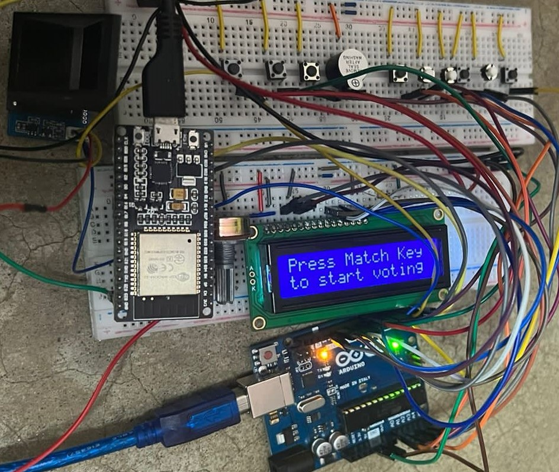

# EVM_G2_EEE416
IOT based EVM project with fingerprint sensor  
Features:  
<ul>
  <li> IoT based voting reporting and real time monitoring </li> 
  <li> Battery backup </li>
  <li> Security features </li>  
  </ul>
 

 

Youtube Link:  <a href ="https://youtu.be/66s9SdI0HrA">EVM Demonstration</a> 
Thingspeak channel Link: <a href="https://thingspeak.com/channels/1843139">EVM channel</a>  
